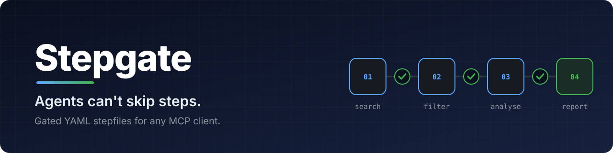

<a id="readme-top"></a>

<div align="center">
  

  <p align="center">

[![CI][ci-shield]][ci-url]
[![npm][npm-shield]][npm-url]
[![Stargazers][stars-shield]][stars-url]
[![Issues][issues-shield]][issues-url]
[![License: Apache-2.0][license-shield]][license-url]

  </p>

  <p align="center">
    Write an agent's procedure once, as a YAML stepfile, and every step is gated.
    <br />
    <a href="docs/stepfile.md"><strong>Read the stepfile format »</strong></a>
    <br />
    <br />
    <a href="#quick-start">Quick start</a>
    &middot;
    <a href="stepfiles/">Browse the catalog</a>
    &middot;
    <a href="https://github.com/Chaarangan/stepgate/issues/new?template=bug_report.yml">Report a bug</a>
    &middot;
    <a href="https://github.com/Chaarangan/stepgate/issues/new?template=feature_request.yml">Request a feature</a>
  </p>
</div>

<details>
  <summary>Table of contents</summary>
  <ol>
    <li>
      <a href="#about-the-project">About the project</a>
      <ul>
        <li><a href="#why">Why</a></li>
        <li><a href="#built-with">Built with</a></li>
      </ul>
    </li>
    <li>
      <a href="#getting-started">Getting started</a>
      <ul>
        <li><a href="#prerequisites">Prerequisites</a></li>
        <li><a href="#quick-start">Quick start</a></li>
      </ul>
    </li>
    <li>
      <a href="#usage">Usage</a>
      <ul>
        <li><a href="#a-stepfile">A stepfile</a></li>
        <li><a href="#make-the-procedure-you-already-wrote-enforceable">Make the procedure you already wrote enforceable</a></li>
        <li><a href="#command-line">Command line</a></li>
      </ul>
    </li>
    <li><a href="#catalog">Catalog</a></li>
    <li><a href="#documentation">Documentation</a></li>
    <li>
      <a href="#contributing">Contributing</a>
      <ul>
        <li><a href="#contributors">Contributors</a></li>
      </ul>
    </li>
    <li><a href="#license">License</a></li>
    <li><a href="#contact">Contact</a></li>
    <li><a href="#acknowledgments">Acknowledgments</a></li>
  </ol>
</details>

## About the project

**Agents can't skip steps.** The agent moves on only when a mechanical check passes, never on its own word. Stepgate is for anyone running agents on procedures where a skipped step or an invented value costs something, such as a cited research report, a CVE triage or a ticket written to Jira.

**One file runs anywhere.** A stepfile has no packages, no versions to pin and no code to deploy, so it moves as a single file to any MCP client, such as Claude Code, Cursor or an agent you wrote, and runs on the model that client already uses.

A **stepfile** declares its inputs, the remote APIs and MCP servers it may call, and an ordered list of steps. Each step says what output it must produce and which **gates** check that output. The file names no model and no framework.

**Stepgate** runs stepfiles. It is an MCP server that offers each stepfile as a tool. When a client's agent calls it, Stepgate shows the agent one step at a time, makes every API call the step needs, and moves on only when the step's gates pass.

### Why

When an agent is handed a plan as text, it decides how much of the plan to follow, a step counts as done when the agent says so, and nothing records afterwards what actually ran. A stepfile moves those decisions out of the model:

- **Steps run in order, one at a time.** The agent is shown only the current step's instructions and operations, never a later step, so it cannot skip ahead. Earlier steps stay in its own conversation.
- **Gates decide, not the model.** A step passes only when its output satisfies JSON Schema, JSONLogic or an HTTP verifier, and gates can check that output against what the APIs actually returned, so a fabricated value fails. A failed gate's diagnosis goes back to the model for a bounded number of retries.
- **The model judges, the server computes.** A mechanical step makes its API calls and builds its output from a template, with no model involved, and a derived field fills in a count or a lookup after the model submits. The model is left the work that needs judgement.
- **Writes wait for a person.** An approve gate asks a person to confirm a step's output through an MCP elicitation before a later mechanical step writes it, so what reaches Jira is what the person saw ([which clients show the form](docs/connect.md#approvals)).
- **The model never holds a key.** The server makes every tool call and attaches credentials itself, and it refuses requests to hosts the stepfile does not declare.
- **Every run leaves a record.** A hash-chained ledger lists each step, tool call, gate verdict and retry, and editing it afterwards breaks the chain, which `stepgate --verify` detects.
- **Nothing to install on the client side.** Stepfiles call remote APIs only, and the client adds one MCP server to its configuration. Stepgate needs no model key: the client's own model does the reasoning, and the same file gives the same path through its steps whichever model that is.

<p align="right">(<a href="#readme-top">back to top</a>)</p>

### Built with

* [![TypeScript][typescript-shield]][typescript-url]
* [![Node.js][node-shield]][node-url]
* [![Model Context Protocol][mcp-shield]][mcp-url]
* [![JSON Schema][jsonschema-shield]][jsonschema-url] with [Ajv](https://ajv.js.org/)
* [![JSONLogic][jsonlogic-shield]][jsonlogic-url]

<p align="right">(<a href="#readme-top">back to top</a>)</p>

## Getting started

### Prerequisites

* An MCP client, such as Claude Code, Claude Desktop, Cursor or VS Code.
* Node.js 22.18 or later, so the client can start Stepgate with `npx`.
* The credentials your stepfile declares. The `market-research` example below needs a [Tavily](https://tavily.com/) API key.

### Quick start

1. Add the server to your MCP client's configuration, naming one or more stepfiles from the [catalog](stepfiles/), or giving absolute paths to your own `.stepfile.yaml` files ([details](docs/connect.md#your-own-stepfiles)):

   ```json
   {
     "mcpServers": {
       "stepgate": {
         "command": "npx",
         "args": ["-y", "stepgate", "market-research"],
         "env": { "TAVILY_API_KEY": "tvly-..." }
       }
     }
   }
   ```

2. The client sees a `market-research` tool. Ask your agent to run it for `{ "brand": "Oatly", "market": "UK plant-based milk" }`.

3. The agent works through four steps (search, filter, analyse, report) with `stepgate_call` and `stepgate_submit`, and the run ends with every step's output.

[docs/connect.md](docs/connect.md) has the configuration for Claude Code, Claude Desktop, Cursor, VS Code and other clients.

Every server also offers tools for writing stepfiles: ask your agent to write one for your use case, and it can read the format, inspect the APIs, validate its draft and try it through Stepgate ([details](docs/connect.md#writing-stepfiles-with-an-agent)).

<p align="right">(<a href="#readme-top">back to top</a>)</p>

## Usage

### A stepfile

```yaml
stepgate: "1"
id: market-research
inputs:
  type: object
  required: [brand, market]
  properties:
    brand: { type: string }
    market: { type: string }

credentials:
  tavily:
    kind: bearer
    hosts: [mcp.tavily.com]
    description: Web search, used only by the search step.

tools:
  tavily:
    mcp: { url: "https://mcp.tavily.com/mcp/" }
    credential: tavily
    exposes: [{ name: tavily_search, effect: read }]

steps:
  - id: search
    tools: [tavily_search]
    instructions: |
      Run at least six searches about {{inputs.brand}} in {{inputs.market}}.
      Submit every result as a source with an id of the form S-01.
    produces:
      type: object
      required: [sources]
      properties:
        sources: { type: array }
    gates:
      - id: enough-sources
        schema: { properties: { sources: { minItems: 12 } } }
      - id: domain-breadth
        message: Sources must span at least six distinct domains.
        predicate:
          ">=":
            - { length: { unique: { map: [{ var: output.sources }, { host: { var: url } }] } } }
            - 6
    retries: 2
  # ... filter, analyse and report steps
```

Credentials say what is needed, never where it lives: the server reads `tavily` from `TAVILY_API_KEY`. `effect: read` marks the search as safe to retry. The complete file is [stepfiles/marketing/market-research](stepfiles/marketing/market-research/), and editors that support `yaml-language-server` validate against [server/schema/stepfile.schema.json](server/schema/stepfile.schema.json), which the npm package also ships.

### Make the procedure you already wrote enforceable

A skill or runbook written as markdown tells an agent what to do, and the agent decides how much of it to follow. Here is one:

```markdown
---
name: package-notes
description: Writes an upgrade note for each npm package, with versions taken from the registry.
---
1. Look up each package's latest version on the npm registry.
2. Write a one-line upgrade note for each. Never state a version the registry did not return.
```

`stepgate_outline` turns it into a skeleton, and the finished stepfile makes both lines binding. Stepgate does the lookup itself, so the agent never fetches or copies a version. The agent only writes the notes, and a gate rejects any note whose version differs from what the registry returned, naming the rows that broke it.

<details>
  <summary>The finished <code>package-notes</code> stepfile</summary>

```yaml
stepgate: "1"
id: package-notes
description: Writes an upgrade note for each npm package, with versions taken from the registry.
inputs:
  type: object
  required: [packages]
  properties:
    packages: { type: array, minItems: 1, maxItems: 20, items: { type: string, pattern: "^[a-z0-9][a-z0-9._-]*$" } }
tools:
  npm:
    openapi:
      server: https://registry.npmjs.org
      document:
        openapi: 3.1.0
        info: { title: npm registry, version: "1" }
        paths:
          /{name}/latest:
            get:
              operationId: getLatest
              parameters: [{ name: name, in: path, required: true, schema: { type: string } }]
    exposes: [getLatest]
steps:
  - id: look-up
    do:
      calls:
        - id: latest
          operation: getLatest
          each: { var: inputs.packages }
          arguments: { name: { var: item } }
      output:
        packages: { map: [{ var: responses.latest }, { object: [[name, { var: name }], [latest, { var: version }]] }] }
    produces:
      type: object
      required: [packages]
      properties: { packages: { type: array } }
  - id: notes
    instructions: |
      Write a one-line upgrade note for each of these packages, saying what
      its latest version is and whether that is a new major version:

      {{steps.look-up.packages}}
    produces:
      type: object
      required: [notes]
      properties:
        notes:
          type: array
          items:
            type: object
            required: [name, latest, note]
            properties: { name: { type: string }, latest: { type: string }, note: { type: string } }
    gates:
      - id: versions-from-registry
        message: Every note must give the version the registry returned for its package.
        predicate:
          none:
            - join: [{ var: output.notes }, { var: steps.look-up.packages }, name, name]
            - or: [{ "==": [{ var: right }, null] }, { "!=": [{ var: left.latest }, { var: right.latest }] }]
    retries: 2
```

</details>

### Command line

To serve over HTTP instead of stdio, run `npx -y stepgate --http 3100 market-research` and connect to `http://127.0.0.1:3100/mcp`. `npx -y stepgate --list` shows the catalog, and `--help` lists every option, including these:

| Option | What it does |
|---|---|
| `--watch` | Reloads your stepfiles when you save them, while you write one. |
| `--test <stepfile>` | Checks its gates offline against recorded cases. |
| `--record-cases <dir>` | Records those cases from a real run. |
| `--auth <stepfile> <credential>` | Signs in to an MCP server that uses MCP authorization and prints the variables to set ([details](docs/connect.md#mcp-servers-that-use-mcp-authorization)). |
| `--verify <ledger>` | Checks a run's ledger for edits. |

<p align="right">(<a href="#readme-top">back to top</a>)</p>

## Catalog

[stepfiles/](stepfiles/) is a community catalog of stepfiles, reviewed and shipped with the npm package, so each one runs by name. Built something repeatable? Adding it is one folder and one pull request: see [stepfiles/README.md](stepfiles/README.md), or [suggest an idea](https://github.com/Chaarangan/stepgate/issues/new?template=stepfile_idea.yml).

<p align="right">(<a href="#readme-top">back to top</a>)</p>

## Documentation

| Document | What it covers |
|---|---|
| [docs/stepfile.md](docs/stepfile.md) | How to write a stepfile: fields, tools, credentials, steps and gates. |
| [docs/connect.md](docs/connect.md) | Connecting Claude Code, Claude Desktop and other MCP clients. |
| [docs/how-it-works.md](docs/how-it-works.md) | What Stepgate does during a run, its limits, errors and ledger. |
| [server/schema/stepfile.schema.json](server/schema/stepfile.schema.json) | The JSON Schema for stepfiles. |
| [CONTEXT.md](CONTEXT.md) | The project's vocabulary. |
| [Releases](https://github.com/Chaarangan/stepgate/releases) | What changed in each version. |

<p align="right">(<a href="#readme-top">back to top</a>)</p>

## Contributing

Bug reports, new stepfiles for the catalog and pull requests are all welcome. The [open issues](https://github.com/Chaarangan/stepgate/issues) list proposed features and known bugs, and those labelled [good first issue](https://github.com/Chaarangan/stepgate/labels/good%20first%20issue) are small enough for a first pull request. Adding a stepfile needs no server knowledge: follow [stepfiles/README.md](stepfiles/README.md). For changes to the server or the format, see [CONTRIBUTING.md](CONTRIBUTING.md).

To report a vulnerability, follow [SECURITY.md](SECURITY.md). Everyone taking part is expected to follow the [Code of Conduct](CODE_OF_CONDUCT.md).

### Contributors

<a href="https://github.com/Chaarangan/stepgate/graphs/contributors">
  
</a>

<p align="right">(<a href="#readme-top">back to top</a>)</p>

## License

Distributed under the [Apache License 2.0](LICENSE).

<p align="right">(<a href="#readme-top">back to top</a>)</p>

## Contact

[![GitHub][github-shield]][github-url]

<p align="right">(<a href="#readme-top">back to top</a>)</p>

## Acknowledgments

* [Model Context Protocol](https://modelcontextprotocol.io/)
* [JSON Schema](https://json-schema.org/) and [Ajv](https://ajv.js.org/)
* [JSONLogic](https://jsonlogic.com/)
* [Best-README-Template](https://github.com/othneildrew/Best-README-Template)
* [contrib.rocks](https://contrib.rocks/)

<p align="right">(<a href="#readme-top">back to top</a>)</p>

[ci-shield]: https://github.com/Chaarangan/stepgate/actions/workflows/ci.yml/badge.svg
[ci-url]: https://github.com/Chaarangan/stepgate/actions/workflows/ci.yml
[npm-shield]: https://img.shields.io/npm/v/stepgate.svg
[npm-url]: https://www.npmjs.com/package/stepgate
[stars-shield]: https://img.shields.io/github/stars/Chaarangan/stepgate.svg
[stars-url]: https://github.com/Chaarangan/stepgate/stargazers
[issues-shield]: https://img.shields.io/github/issues/Chaarangan/stepgate.svg
[issues-url]: https://github.com/Chaarangan/stepgate/issues
[license-shield]: https://img.shields.io/badge/license-Apache--2.0-blue.svg
[license-url]: LICENSE
[typescript-shield]: https://img.shields.io/badge/TypeScript-3178C6?style=for-the-badge&logo=typescript&logoColor=white
[typescript-url]: https://www.typescriptlang.org/
[node-shield]: https://img.shields.io/badge/Node.js-5FA04E?style=for-the-badge&logo=nodedotjs&logoColor=white
[node-url]: https://nodejs.org/
[mcp-shield]: https://img.shields.io/badge/MCP-000000?style=for-the-badge&logo=modelcontextprotocol&logoColor=white
[mcp-url]: https://modelcontextprotocol.io/
[jsonschema-shield]: https://img.shields.io/badge/JSON%20Schema-000000?style=for-the-badge&logo=json&logoColor=white
[jsonschema-url]: https://json-schema.org/
[jsonlogic-shield]: https://img.shields.io/badge/JSONLogic-555555?style=for-the-badge
[jsonlogic-url]: https://jsonlogic.com/
[github-shield]: https://img.shields.io/badge/Chaarangan-181717?style=for-the-badge&logo=github&logoColor=white
[github-url]: https://github.com/Chaarangan
